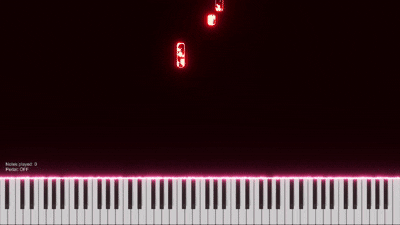
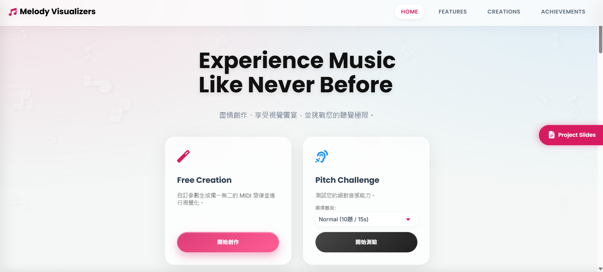
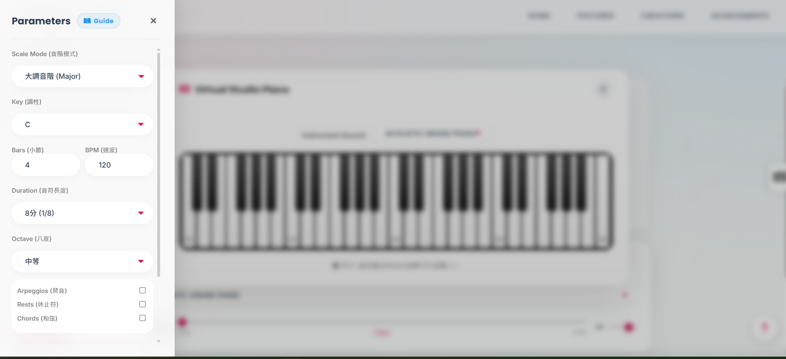
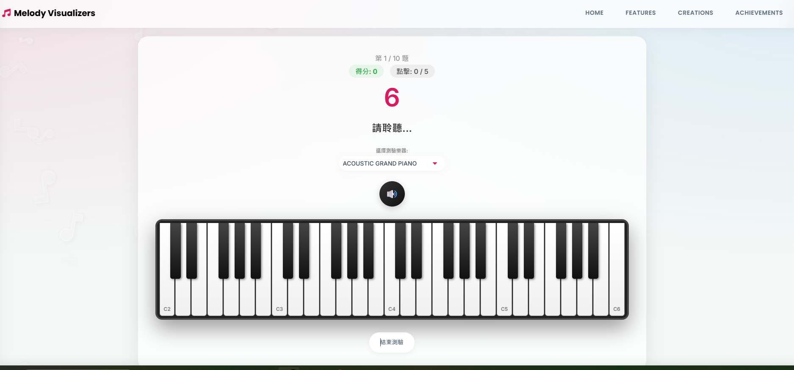
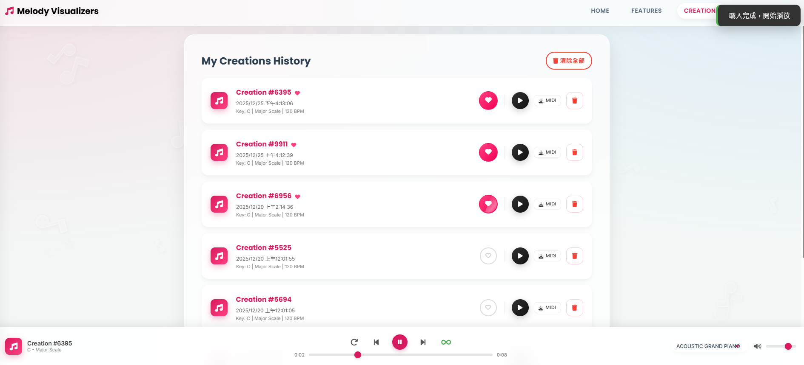
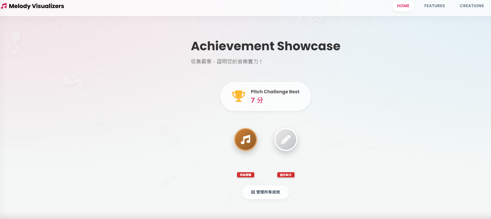

<div align="center">
	<h1>Melody Visualizers</h1>
	<!--ADD SHIELD.IO Icons here-->
	<p>
		<a href="https://nodejs.org/"></a>
		<a href="https://expressjs.com/"></a>
		<a href="https://www.python.org/"></a>
		<a href="https://tonejs.github.io/"></a>
		<a href="https://www.autohotkey.com/"></a>
		<a href="https://github.com/YHC2538/Melody_Visualizers"></a>
		<a href="https://github.com/YHC2538/Melody_Visualizers"></a>
	</p>
</div>

本專案是一個以「**MIDI 旋律生成 → 站內試聽 → 4K 視覺化渲染 → 聽力訓練**」為核心的 Web 平台。

專案的所有資源: https://github.com/YHC2538/Melody_Visualizers


- 前端入口：`public/index.html`（由 Node/Express 提供靜態服務）
- 後端伺服器：`server.js`（API：生成 MIDI、渲染影片、查詢排隊）
- MIDI 生成 CLI：`scripts/midigenapp_cli.py`（Node 透過 `python ...` 呼叫）


<hr>

## 1. 特色

1) **創作＋視覺化＋訓練三合一**
- Free Creation：自訂音階/調性/BPM/小節等參數生成 MIDI
- Visualize：把 MIDI 轉成 WAV，再用 Piano VFX 產出 MP4（提供站內播放與下載）
- Pitch Challenge：互動式絕對音感測驗（多難度、計時、成績與成就）
- 創作儲存功能: 後端儲存所有創作, 使用者最多可以存 10 份 MIDI 創作與 mp4


2) **不依賴前端框架的完整互動式 UI**
- 單頁多 screen 切換（Home / Main / Test / Creations）
- Toast、Modal、Tour 新手導覽、Achievement 成就展示櫃

3) **工程化的渲染佇列（避免 UI 自動化衝突）**
- 影片渲染會「搶佔滑鼠/視窗」（AutoHotkey + Piano VFX），因此後端使用 Queue + Polling 呈現排隊狀態與等待時間。
- Queue 優化: 針對多人同時請求或惡意請求有保護機制。

### 渲染 Demo:
<div align="center">
	
</div>

---

## 2. 網站最後版本的頁面架構（頁面/畫面結構）


### 2.1 Screen（主要頁面）

- `#start-screen`（Home）

	- Free Creation：進入 `#main-screen`
	- Pitch Challenge：難度下拉 + 開始測驗（進入 `#test-screen`）
	- Home Sections（同頁捲動）：Features / Studio Spotlight / Achievements Showcase

- `#main-screen`（創作/生成/視覺化工作區）

	- 參數側欄（Sidebar）：Scale/Key/Bars/BPM/Duration/Octave、Arpeggios/Rests/Chords
	- Preview（試聽）：Tone.js + @tonejs/midi + SoundFont Sampler
	- Visualize（渲染影片）：顯示佇列狀態、完成後提供 MP4 播放/下載

- `#test-screen`（Pitch Challenge 測驗）

	- 倒數計時、分數、可用嘗試次數
	- 鋼琴鍵盤 UI：點擊作答、可切換測驗樂器

- `#creations-screen`（My Creations History）

	- 最近 10 筆創作紀錄（localStorage）
	- 播放、下載 MIDI、播放影片（若已渲染）、收藏/取消收藏、刪除、清除全部
	- 底部播放器（loop / autoplay / seek / 換樂器 / 音量）

### 2.2 共用 UI


- Navbar（Home/Features/Creations/Achievements）
- Toast 通知
- 多種 Modal：測驗結果、結束確認、清除歷史、刪除單筆、影片播放、成就管理、Help/Guide/Tour

---

## 3. 系統架構與資料流

### 3.1 MIDI 生成流程

1. 使用者在 `#main-screen` 設定參數，點擊「生成 MIDI」
2. 前端 `fetch` 呼叫：`POST /api/generate-midi`
3. 後端 `server.js` 透過 `child_process.spawn('python', ...)` 執行 `scripts/midigenapp_cli.py`
4. Python 端以 HTTP 方式呼叫 `https://midigen.app/generate`（外部服務），取得 MIDI bytes
5. 後端回傳 `midiUrl`（例如 `/midi/melody_<timestamp>.mid`），前端更新播放器/歷史紀錄/成就

### 3.2 影片渲染流程（Queue）

1. 使用者點擊「渲染影片」
2. 前端呼叫：`POST /api/render-video`（body: `{ midiFilename }`）
3. 後端加入 Render Queue（避免同時渲染造成 AHK/視窗衝突），並以 IP 做：
	 - 同時只允許一個工作（activeIPs）
	 - 完成後冷卻 60 秒（userCooldowns）
4. 渲染管線：
	 - TiMidity++：MIDI → WAV（使用 SoundFont：FluidR3_GM.sf2）
	 - AutoHotkey：自動操作 Piano VFX 匯入 MIDI/WAV 並 Render
	 - 監聽 `videos/` 新增的 `Piano-VFX*.mp4`，重命名成 `melody_<timestamp>.mp4`
5. 前端用 Polling 觀察排隊狀態：`GET /api/queue-status?filename=...`
6. 完成後回傳 `videoUrl`，前端更新歷史紀錄與下載連結

---

## 4. Web 技術（含開源/外部資源與實作方式）

### 4.1 前端（Vanilla + Web Audio）

- HTML/CSS/JavaScript（無框架）
	- `public/index.html`：畫面結構、互動邏輯、localStorage、UI 狀態管理
- Canvas 2D：背景漂浮音符動畫
- Web Audio：使用 Tone.js
- MIDI 解析：使用 `@tonejs/midi`（ESM 由 esm.sh 引入）
- SoundFont 取樣播放（Sampler baseUrl 指向公開 SoundFont mp3 資源）

### 4.2 後端（Node.js / Express）

- Express（靜態檔案 + API）
- cors / body-parser（JSON body、跨域）
- child_process（呼叫 Python、TiMidity++、AutoHotkey）
- Queue + Polling API（`/api/queue-status`）

### 4.3 Python（MIDI 生成 CLI）

- `requests`：向外部 API 的 AI 模型發送表單請求並取得 MIDI bytes
- CLI 參數：`--params`（JSON 字串）、`--output`（輸出路徑）

### 4.4 工具鏈（視覺化與音訊轉換）

- TiMidity++（MIDI → WAV）：位於 `tools/TiMidity++-2.15.0/`
- SoundFont（GM 音色）：`tools/FluidR3_GM.sf2`
- AutoHotkey（UI 自動化）：`scripts/render_video.ahk` + `scripts/AutoHotkeyU64.exe`（這程式不好寫）
- Piano VFX（視覺化引擎）：位於 `scripts/piano_vfx/piano_vfx/`

### 4.5 開源/外部引用清單

本專案前端/後端/工具鏈有使用或依賴以下開源或外部資源：

- Tone.js（Web Audio）：CDN
- @tonejs/midi（MIDI parser）：ESM（esm.sh）
- SoundFont mp3（公開資源庫）：以 `gleitz/midi-js-soundfonts` 的 GitHub Pages URL 作為取樣來源（播放器會載入各音階 mp3）
- Font Awesome（圖示）：CDN
- Google Fonts（Inter/Poppins）：CDN
- Express / cors / body-parser：NPM 套件
- TiMidity++（MIDI→WAV）：工具套件
- FluidR3 GM SoundFont：GM 音色檔
- AutoHotkey：自動化工具
- `midigen.app`：外部 MIDI 生成服務（Python 端以 HTTP 呼叫其 `/generate`）

---


## 5. 專案結構（資料夾用途）

```
public/               # 最終版前端（index.html + MIDI 播放模組）
server.js             # Express 後端與渲染佇列
scripts/              # Python CLI、AHK、自動化與 VFX 工具
midi/                 # 生成的 .mid 會放這裡（server 啟動時自動建立）
sounds/               # 轉出的 .wav（server 啟動時自動建立）
videos/               # 生成的 .mp4（server 啟動時自動建立）
tools/                # TiMidity++、SoundFont 等
```

---

## 6. 安裝與執行（Windows）

### 6.1 必要條件

- Node.js（建議 LTS）
- Python 3.10+
- 網路連線

### 6.2 安裝（一次性）

1) 安裝 Node 依賴：

```bash
npm install
```

2) 建議建立 Python 虛擬環境並安裝 dependencies（至少需要 requests）：

```bash
python -m venv .venv

# PowerShell
.\.venv\Scripts\Activate.ps1

# 或使用 cmd.exe
# .venv\Scripts\activate.bat

pip install -U pip
pip install requests
```

> 注意：後端會用 `spawn('python', ...)` 執行 Python。
> 因此請在「已啟用虛擬環境」的終端機中啟動 Node 伺服器，才能確保 `python` 指到正確的環境。

### 6.3 啟動

```bash
node server.js
```

打開瀏覽器：

- http://localhost:3000

---

## 7. API 文件（後端實際提供）

### 7.1 產生 MIDI

- `POST /api/generate-midi`
- Body（JSON）：

```json
{
	"scale": "Major Scale",
	"key": "0",
	"bars": "4",
	"tempo": "120",
	"note_duration": "0.5",
	"octave": "0",
	"include_arpeggios": "on",
	"include_rests": null,
	"include_chords": null
}
```

- Response（成功）：

```json
{
	"success": true,
	"message": "MIDI 生成成功",
	"midiUrl": "http://localhost:3000/midi/melody_<timestamp>.mid",
	"filename": "melody_<timestamp>.mid",
	"timestamp": 1765...
}
```

### 7.2 渲染影片（加入 Queue）

- `POST /api/render-video`
- Body：

```json
{ "midiFilename": "melody_<timestamp>.mid" }
```

- Response（成功）：

```json
{
	"success": true,
	"message": "影片生成成功",
	"videoUrl": "http://localhost:3000/videos/melody_<timestamp>.mp4",
	"filename": "melody_<timestamp>.mp4"
}
```

- 常見錯誤：
	- `429`：同一 IP 已有任務排隊/渲染中，或冷卻時間未到

### 7.3 查詢排隊狀態（前端 Polling）

- `GET /api/queue-status?filename=melody_<timestamp>.mid`
- Response 範例：
	- `{ "status": "queued", "position": 2, "waitTime": "120 秒" }`
	- `{ "status": "rendering", "position": 0, "waitTime": "處理中..." }`
	- `{ "status": "unknown", "position": -1, "waitTime": "--" }`

---

## 8. 注意事項與限制

- 影片渲染會啟動 AutoHotkey 去操作 Piano VFX 視窗：渲染期間可能無法正常使用同一台電腦（滑鼠/視窗會被自動化流程佔用）。
- `public/midiplayer.js` 的 SoundFont 音檔來源為外部 URL：離線環境可能無法試聽。
- 影片渲染功能 unstable.


